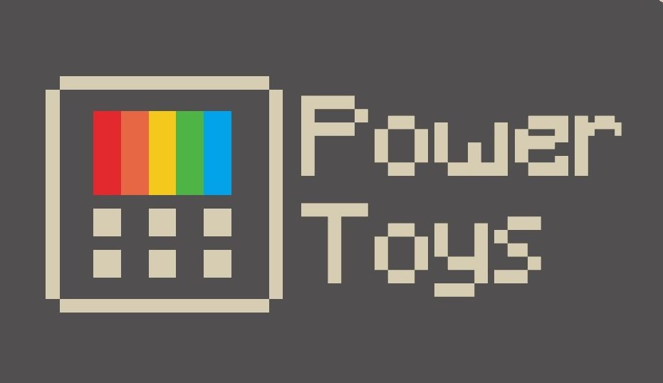
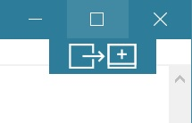
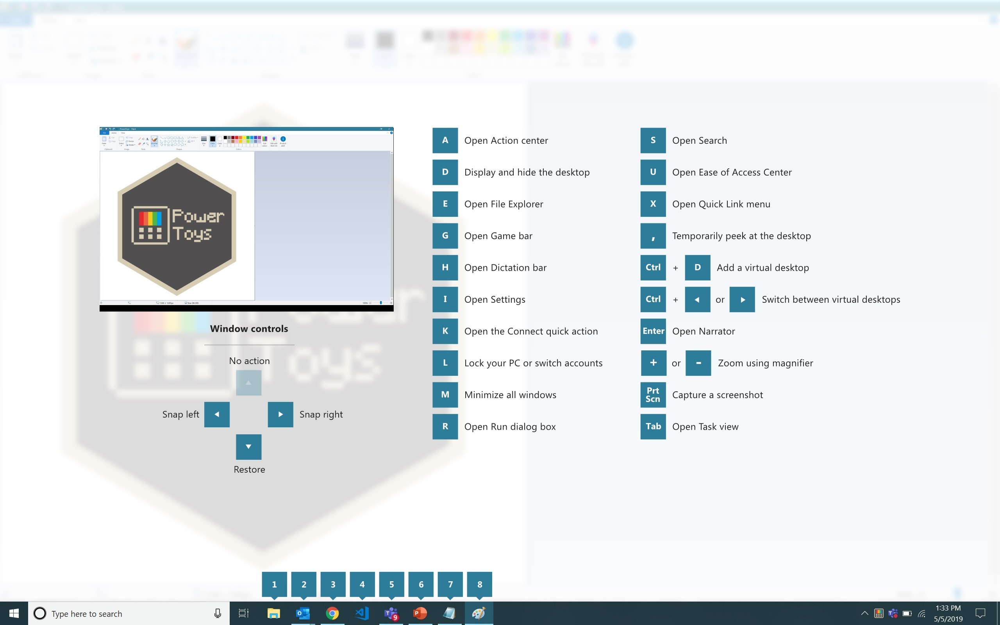

# Overview

PowerToys is a set of utilities for power users to tune and streamline their Windows experience for greater productivity.  

Inspired by the [Windows 95 era PowerToys project](https://en.wikipedia.org/wiki/Microsoft_PowerToys), this reboot provides power users with ways to squeeze more efficiency out of the Windows 10 shell and customize it for individual workflows.  A great overview of the Windows 95 PowerToys can be found [here](https://socket3.wordpress.com/2016/10/22/using-windows-95-powertoys/).

The first preview of these utilities and corresponding source code will be released Summer 2019.

# What's Happening

## June Update
Since the announcement of the PowerToys reboot at BUILD, the interest in the project has been incredible to see.  Due to the excitement we are optimizing the first preview to make it easy to integrate new utilities into the repo.  We also have two interns working on additional PowerToys.  The specs for these are:

* [Process terminate tool](https://github.com/indierawk2k2/PowerToys-1/blob/master/specs/Terminate%20Spec.md)
* [Batch file renamer](https://github.com/indierawk2k2/PowerToys-1/blob/master/specs/File%20Classification%20Spec.md)
* [Animated gif screen recorder](https://github.com/indierawk2k2/PowerToys-1/blob/master/specs/GIF%20Maker%20Spec.md)

Finally, we are organizing a team to productize an internal window manager into the PowerToys project for the 2019 [One Week Hackathon](https://www.onmsft.com/news/take-a-peek-inside-microsofts-recent-one-week-hackathon).

We are still targeting to release the preview and code during Summer 2019.

## The first two utilities we're working on are:

1. Maximize to new desktop widget - The MTND widget shows a pop-up button when a user hovers over the maximize / restore button on any window.  Clicking it creates a new desktop, sends the app to that desktop and maximizes the app on the new desktop.

2. Windows key shortcut guide - The shortcut guide appears when a user holds the Windows key down for more than one second and shows the available shortcuts for the current state of the desktop.

# Backlog

Here's the current set of utilities we're considering.  Please use issues and +1's to guide the project to suggest new ideas and help us prioritize the list below.

1. [Full window manager including specific layouts for docking and undocking laptops](https://github.com/microsoft/PowerToys/issues/4)
2. [Keyboard shortcut manager](https://github.com/microsoft/PowerToys/issues/6)
3. [Win+R replacement](https://github.com/microsoft/PowerToys/issues/44)
4. Better Alt+Tab including browser tab integration and search for running apps
5. [Battery tracker](https://github.com/microsoft/PowerToys/issues/7)
6. [Batch file re-namer](https://github.com/microsoft/PowerToys/issues/101)
7. [Quick resolution swaps in taskbar](https://github.com/microsoft/PowerToys/issues/27)
8. Mouse events without focus
9. Cmd (or PS or Bash) from here
10. Contents menu file browsing

# Where to download PowerToys

  The latest release of PowerToys can be downloaded from https://github.com/microsoft/PowerToys/releases  
  Click on `Assets` to show the files available in the release and then click on `PowerToysSetup.msi` to download the PowerToys installer.

# Developer Guidance

## Build Prerequisites
 * Windows 10 1803 (build 10.0.17134.0) or above in order to build and run PowerToys.
 * Visual Studio 2017 Community version 15.9.12 or higher, with the 'Desktop Development with C++' component and the Windows 10 SDK version 10.0.17763.0.
 
## Building the Code
 * Open `powertoys.sln` in Visual Studio, in the `Solutions Configuration` drop-down menu select `Release` or `Debug`, from the `Build` menu choose `Build Solution`.
 * The PowerToys binaries will be located in your repo under `x64\Release`.
 * If you want to copy the `powertoys.exe` binary to a different location, you'll also need to copy the `modules` and the `svgs` folders.

## Prerequisites to Build the Installer
 * Install the [WiX Toolset Visual Studio 2017 Extension](https://marketplace.visualstudio.com/items?itemName=RobMensching.WiXToolset).
 * Install the [WiX Toolset build tools](https://wixtoolset.org/releases/).
 
## Building the .msi Installer
  * From the `installer` folder open `PowerToysSetup.sln` in Visual Studio, in the `Solutions Configuration` drop-down menu select `Release` or `Debug`, from the `Build` menu choose `Build Solution`.
  * The resulting `PowerToysSetup.msi` installer will be available in the `installer\PowerToysSetup\x64\Release\` folder.

## Debugging
  The following configuration issue only applies if the user is a member of the Administrators group.
  
  Some PowerToys modules require to run with the highest permission level if the current user is a member of the Administrators group. The highest permission level is required in order to be able to perform some actions when an elevated application (e.g. Task Manager) is in the foreground or is the target of an action. Without elevated privileges some PowerToys modules will still work but with some limitations:
 - the `Maximize to New Desktop` module will be able to move an elevated window to a new desktop but it will not be able to maximize it.
 - the `Shortcut Guide` module will not appear if the foreground window belongs to an elevated application.
 
 In order to run and debug PowerToys from Visual Studio when the user is a member of the Administrators group, Visual Studio has to be started with elevated privileges. If you want to avoid running Visual Studio with elevated privileges and don't mind the limitations described above, you can do the following: open the `runner` project properties and navigate to the `Linker -> Manifest File` settings, edit the `UAC Execution Level` property and change it from `highestAvailable (/level='highestAvailable')` to `asInvoker (/level='asInvoker')`, save the changes.
 
## How to create new PowerToys

See the instructions on [how to install the PowerToy Module project template](tools/project_template).  
Specifications for the [PowerToys settings API](doc/specs/PowerToys-settings.md).

## Coding Guidance

Please review these brief docs below relating to our coding standards etc.

> 👉 If you find something missing from these docs, feel free to contribute to any of our documentation files anywhere in the repository (or make some new ones\!)

This is a work in progress as we learn what we'll need to provide people in order to be effective contributors to our project.
- [Coding Style](doc/coding/style.md)
- [Code Organization](doc/coding/organization.md)

# Contributing

This project welcomes contributions and suggestions.  Most contributions require you to agree to a
Contributor License Agreement (CLA) declaring that you have the right to, and actually do, grant us
the rights to use your contribution. For details, visit https://cla.microsoft.com.

When you submit a pull request, a CLA-bot will automatically determine whether you need to provide
a CLA and decorate the PR appropriately (e.g., label, comment). Simply follow the instructions
provided by the bot. You will only need to do this once across all repos using our CLA.

# Code of Conduct

This project has adopted the [Microsoft Open Source Code of Conduct][conduct-code].  
For more information see the [Code of Conduct FAQ][conduct-FAQ] or contact [opencode@microsoft.com][conduct-email] with any additional questions or comments.

[conduct-code]: https://opensource.microsoft.com/codeofconduct/ 
[conduct-FAQ]: https://opensource.microsoft.com/codeofconduct/faq/
[conduct-email]: mailto:opencode@microsoft.com
